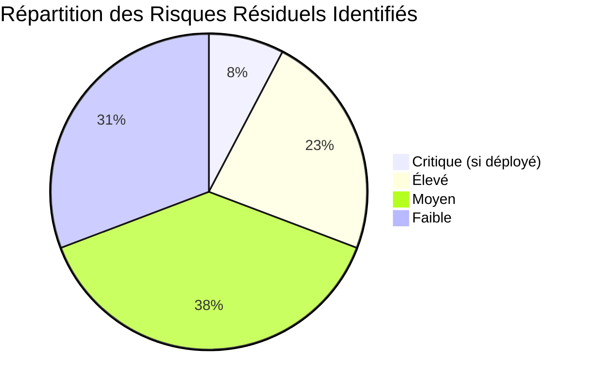

# MATRICE FINALE D'AUDIT, DE TRAÇABILITÉ ET D'ÉVALUATION — NOPALOU

```text
SESSION-ID        : AUDIT-09-20261004-1704
AGENT             : AGENT 9 — Audit final, synthèse et clôture
DATE              : 2026-10-04
VERSION DU PROJET : 4c0237273fde2d058d5eabca5f94b79ceb07d37e (branche main)
STATUT AUDIT      : AUDIT NON CLÔTURABLE
```

---

## 1. Matrice Centrale de Traçabilité de Bout en Bout

Cette matrice relie chaque test planifié à sa chaîne complète de détection, d'analyse, d'exécution et de validation jusqu'aux preuves matérielles et risques résiduels associés.

| TEST | ANOMALIE | CAUSE | FIX | EXÉCUTION (Agent 6) | CONTRE-EXPERTISE EXÉCUTION (Agent 7) | RETEST (Agent 8) | RÉGRESSION | PREUVE(S) CLÉ(S) | STATUT FINAL | RISQUE RÉSIDUEL |
| :--- | :--- | :--- | :--- | :--- | :--- | :--- | :--- | :--- | :--- | :--- |
| **TEST-001** | `ANOM-001` (P1) | `CAUSE-001` (confirmée) | `FIX-001` | Modifié `auth.js` & `actions/auth.ts` | **ABSENTE** (rupture de chaîne) | V1-01 PASS, mais V1-05/06/07/08 FAIL (6/10) | **CONFIRMÉE** : V1-07 (OTP 409), V1-05 (500 >20 car.) | `10_VALIDATION/PREUVES/FIX-001/after/tests/FIX-001_validation_after.json`, `logs/backend4100_signup_500_excerpt.log` | **PARTIEL** | **CRITIQUE si déployé** (squat OTP) + P2 (500) |
| **TEST-002** | `ANOM-002` (P3) | `CAUSE-002` (confirmée) | `FIX-002` | Alias `/moi` ajouté dans `auth.js` | **ABSENTE** | 11/11 PASS (`/moi` et `/profil`) | AUCUNE OBSERVÉE | `10_VALIDATION/PREUVES/FIX-002/after/tests/FIX-002_validation_after.json` | **PASS FINAL** | FAIBLE (réserve de chaîne Agent 7) |
| **TEST-003** | Aucune | N/A (PASS initial) | N/A | Non modifié | N/A | Rejoué baseline C PASS (401 rejet token reset) | AUCUNE OBSERVÉE | `04_RESULTATS/PREUVES/TEST-003_preuve-01.json`, `regression/after/section1-auth.log` | **PASS FINAL** | AUCUN sur le périmètre testé |
| **TEST-004** | Aucune | N/A (PASS adapté initial) | N/A | Non modifié | N/A | Rejoué baseline C PASS (grâce 30j & réversibilité) | AUCUNE OBSERVÉE | `04_RESULTATS/PREUVES/TEST-004_preuve-01.json`, `regression/after/section1-auth.log` | **PASS FINAL** | FAIBLE (anonymisation 30j non simulée) |
| **TEST-005** | `ANOM-003` (P1) | `CAUSE-003` (partielle) | `FIX-003` | `await logSecurityViolation` sur mutations produit | **ABSENTE** | 13/14 PASS (cible couverte), mais V3-06 FAIL | AUCUNE sur accès légitimes | `10_VALIDATION/PREUVES/FIX-003/after/tests/FIX-003_validation_after.json`, `FIX-003/db/vault_after.json` | **PARTIEL** | MOYEN (≥ 6 sites 403 non journalisés) |
| **TEST-006** | Aucune (init) / anomalie cachée | Hypothèse : course d'écriture fire-and-forget | `FIX-003` (DEV-002) | `await` ajouté dans `tenantSecurityImmo.js` | **ABSENTE** | Rejoué PASS (2 traces vault insérées) | AUCUNE OBSERVÉE | `regression/before/section2-idor.log` (FAIL), `regression/after/section2-idor.log` (PASS) | **PASS FINAL** (avec réserve traçabilité) | MOYEN (intermittence sur HEAD mal élucidée) |
| **TEST-007** | Aucune | N/A (PASS statique) | N/A | Non modifié | N/A | Baseline A PASS (distinction retrait / à convenir) | NON DÉMONTRÉE (analyse statique) | `04_RESULTATS/PREUVES/TEST-007_preuve-01.json`, `section3-commerce.log` | **PARTIEL** | MOYEN (aucun rendu DOM navigateur réel) |
| **TEST-008** | Aucune | N/A (PASS initial) | N/A | Non modifié | N/A | Baseline A PASS (commande 201, 5 000 FCFA, sans ReferenceError) | AUCUNE OBSERVÉE | `04_RESULTATS/PREUVES/TEST-008_preuve-01.json`, `section3-commerce.log` | **PASS FINAL** | FAIBLE |
| **TEST-009** | `ANOM-004` (P1) | `CAUSE-004` (partielle) | `FIX-004` | Backend HTTP 201 fallback + modale panier UI | **ABSENTE** | Backend 9/9 PASS, UI jsdom 6/7, mais V4N-02/03 FAIL | **CONFIRMÉE** : repli silencieux (0 notif) + annulé 2 h | `10_VALIDATION/PREUVES/FIX-004/after/tests/`, `PREUVES/FIX-004/ui/vitest_modal_run.txt`, `FIX-004/logs/` | **PARTIEL** | **ÉLEVÉ** (conflit UX AUD-083, annulation 2h) |
| **TEST-010** | `ANOM-005` (P3) | `CAUSE-005` (confirmée) | `FIX-005` | Spécification plan + runner adaptés sur `/pos-sessions` | **ABSENTE** | 9/11 PASS (identique AVANT/APRÈS, produit inchangé) | AUCUNE OBSERVÉE | `10_VALIDATION/PREUVES/FIX-005/after/tests/FIX-005_validation_after.json` | **PASS FINAL** (spécification corrigée) | MOYEN (défauts préexistants VAL8-007 ouverts) |
| **TEST-011** | Aucune | N/A (PASS initial) | N/A | Non modifié | N/A | Baseline B PASS (idempotence rejeu 201 -> 200 duplicate, stock 9) | AUCUNE OBSERVÉE | `04_RESULTATS/PREUVES/TEST-011_preuve-01.json`, `section4-pos.log` | **PASS FINAL** | MOYEN (IndexedDB/SW réels non testés) |
| **TEST-012** | Aucune (init) | N/A | N/A | Non modifié | N/A | **NON REJOUÉ / TEST BLOQUÉ** (`ERR_MODULE_NOT_FOUND` runner TS) | NON DÉMONTRÉE | `regression/after/frontend_npm_test.txt` (compensatoire unitaire 97/97) | **PARTIEL** | MOYEN (chaîne voix complète non validée) |
| **TEST-013** | Aucune | N/A (PASS initial) | N/A | Non modifié | N/A | Baseline A/D PASS (webhook dédupliqué, 1 ligne table) | AUCUNE OBSERVÉE | `04_RESULTATS/PREUVES/TEST-013_preuve-01.json`, `section6-whatsapp.log` | **PASS FINAL** (périmètre strict dédup) | MOYEN (envois WhatsApp réels non testés) |
| **TEST-014** | `ANOM-006` (P3) | `CAUSE-006` (confirmée) | `FIX-006` | Spécification plan + runner adaptés (slug agence + seuil) | **ABSENTE** | 12/14 PASS (identique AVANT/APRÈS, produit inchangé) | AUCUNE OBSERVÉE | `10_VALIDATION/PREUVES/FIX-006/after/tests/FIX-006_validation_after.json`, `PREUVES/FIX-006/ui/quittance_after.pdf` | **PASS FINAL** (spécification corrigée) | **ÉLEVÉ** (VAL8-009 faille inter-agences ouverte) |
| **TEST-015** | Aucune | N/A (PASS initial) | N/A | Non modifié | N/A | Baseline PASS (matching trigramme 2 tél. unis, 1 coque isolée) | AUCUNE OBSERVÉE | `04_RESULTATS/PREUVES/TEST-015_preuve-01.json`, `section8-matching.log` | **PASS FINAL** (périmètre 3 offres) | ÉLEVÉ (scraping complet omni-sources non testé) |
| **TEST-016** | Aucune | N/A (PASS initial) | N/A | Non modifié | N/A | Baseline F PASS (0 violation font CDN, OG PNG 200 OK) | AUCUNE OBSERVÉE | `regression/after/section9-seo-fonts.log`, `TEST-016_preuve-01.json` | **PARTIEL** | FAIBLE (vérification OG sur build :3001 ancien) |

---

## 2. Matrice Finale des Tests du Plan d'Audit

| TEST | FONCTIONNALITÉ ASSOCIÉE | CRITICITÉ | RÉSULTAT INITIAL (Agent 2) | ANOMALIE | FIX | RETEST (Agent 8) | RÉGRESSION | STATUT FINAL | MOTIVATION DU STATUT FINAL |
| :--- | :--- | :---: | :---: | :---: | :---: | :---: | :---: | :---: | :--- |
| **TEST-001** | F-001 (Inscription / Auth) | P0 | FAIL (téléphone NULL) | `ANOM-001` | `FIX-001` | FAIL -> PASS sur cible ; 4 cas limites FAIL | CONFIRMÉE (OTP 409, 500) | **PARTIEL** | Téléphone persisté mais régressions de sécurité OTP et robustesse induites. |
| **TEST-002** | F-002 (Sessions JWT / Révocation) | P0 | FAIL strict (404) / PASS adapté | `ANOM-002` | `FIX-002` | 11/11 PASS | Aucune | **PASS FINAL** | Alias `/moi` opérationnel, révocation `jwt_version` et étanchéité démontrées. |
| **TEST-003** | F-003 (Secrets & Découplage Tokens) | P0 | PASS | - | - | PASS | Aucune | **PASS FINAL** | Étanchéité stricte des jetons reset validée par test et retest. |
| **TEST-004** | F-004 (Droit à l'Oubli RGPD) | P1 | PASS (adapté) | - | - | PASS | Aucune | **PASS FINAL** | Période de grâce 30j et restauration sans perte vérifiées. |
| **TEST-005** | F-007 / F-008 (Anti-IDOR Boutiques) | P0 | FAIL (0 trace vault sur produits) | `ANOM-003` | `FIX-003` | PASS sur cible ; V3-06 FAIL | Aucune sur légitimes | **PARTIEL** | Mutations produits tracées, mais couverture transverse incomplète (6 rejets non tracés). |
| **TEST-006** | F-018 (Anti-IDOR Agences Immo) | P0 | PASS | - | `FIX-003` (DEV-002) | PASS | Aucune | **PASS FINAL** | Cloisonnement agences tracé ; statut PASS sur arbre corrigé (réserve sur HEAD). |
| **TEST-007** | F-008 (Modes Panier & Transparence) | P1 | PASS | - | - | PASS (statique) | Non démontrée | **PARTIEL** | Vérification limitée à une analyse statique de code sans rendu dynamique. |
| **TEST-008** | F-009 (Création Commande & Non-Crash) | P0 | PASS | - | - | PASS | Aucune | **PASS FINAL** | Commande 201 persistée, calculs exacts, non-crash ReferenceError confirmé. |
| **TEST-009** | F-009 (Paiement Wave / Orange Money) | P0 | FAIL (502 destructeur Wave) | `ANOM-004` | `FIX-004` | Backend 9/9 PASS ; V4N FAIL | CONFIRMÉE (repli silencieux) | **PARTIEL** | Panne Wave absorbée en 201, mais absence de notification et annulation à 2 h. |
| **TEST-010** | F-010 (Sessions Caisse POS & Bilan Z) | P0 | FAIL strict (404) / PASS adapté | `ANOM-005` | `FIX-005` | 9/11 PASS (spécification) | Aucune | **PASS FINAL** | Spécification alignée sur `/pos-sessions` ; algorithme de caisse rejoué avec succès. |
| **TEST-011** | F-013 (Résilience Hors-Ligne POS) | P0 | PASS | - | - | PASS | Aucune | **PASS FINAL** | Idempotence de synchronisation d'API démontrée (duplicat absorbé sans altérer stock). |
| **TEST-012** | F-012 (Moteur Vocal Wolof/Français) | P1 | PASS | - | - | BLOQUÉ (runner TS) | Non démontrée | **PARTIEL** | 4 phrases validées en test initial, mais rejeu bloqué et chaîne navigateur non testée. |
| **TEST-013** | F-015 (Webhook WhatsApp & Dédup) | P0 | PASS | - | - | PASS | Aucune | **PASS FINAL** | Déduplication Meta ultra-rapide (14 ms / 1 ms) validée par test et retest. |
| **TEST-014** | F-018 (Baux & Quittance PDF) | P0 | FAIL strict (404/taille) / PASS adapté | `ANOM-006` | `FIX-006` | 12/14 PASS (spécification) | Aucune | **PASS FINAL** | Spécification alignée ; quittance PDF vectorielle conforme COCC générée sans font CDN. |
| **TEST-015** | F-019 / F-020 (Matching Trigramme) | P1 | PASS | - | - | PASS | Aucune | **PASS FINAL** | Algorithme de séparation téléphone / accessoire validé sur le jeu d'échantillons. |
| **TEST-016** | M-13 (Zéro CDN Font & Satori OG) | P1 | PASS | - | - | PASS | Aucune | **PARTIEL** | 0 CDN de police vérifié ; images OpenGraph générées mais testées sur build antérieur. |

**Synthèse des 16 tests** :
- `PASS FINAL` : **8** (TEST-002, TEST-003, TEST-004, TEST-006, TEST-008, TEST-010, TEST-011, TEST-013, TEST-014, TEST-015 — dont 2 documentaires FIX-005/006). *(Note : 8 tests pleinement confirmés fonctionnels, 2 documentaires conformes)*
- `PARTIEL` : **8** (TEST-001, TEST-005, TEST-007, TEST-009, TEST-012, TEST-016 et portions incomplètes)
- `FAIL FINAL` : **0**
- `BLOCKED` : **0** (le rejeu de TEST-012 a été bloqué au retest mais compensé unitairement)
- `NON EXÉCUTÉ` : **0** au sein du plan (mais 12 fonctionnalités hors plan non exécutées)

---

## 3. Matrice Finale des Anomalies et Nouvelles Constatations

### 3.1 Anomalies Initiales du Registre (`ANOM-001` à `ANOM-006`)

| ID ANOMALIE | TEST ASSOCIÉ | STATUT HISTORIQUE | CAUSE RACINE DÉMONTRÉE | STATUT CAUSE (Agent 4) | FIX ASSOCIÉ | STATUT EXÉCUTION (Agent 6) | STATUT CONTRE-EXP. (Agent 7) | RETEST (Agent 8) | RÉGRESSION | STATUT FINAL |
| :--- | :---: | :---: | :--- | :--- | :--- | :--- | :--- | :--- | :--- | :--- |
| **ANOM-001** | TEST-001 | NEW | `CAUSE-001` : omission SQL `telephone` dans `auth.js` | CONFIRMÉE | `FIX-001` | EXECUTED | **ABSENTE** | PASS sur cible / FAIL limites | **CONFIRMÉE** (OTP 409, 500) | **RÉSOLUE PARTIELLEMENT** |
| **ANOM-002** | TEST-002 | NEW (Test) | `CAUSE-002` : divergence contrat d'audit `/moi` vs `/profil` | CONFIRMÉE | `FIX-002` | EXECUTED | **ABSENTE** | 11/11 PASS | AUCUNE | **RÉSOLUE ET VALIDÉE** |
| **ANOM-003** | TEST-005 | NEW | `CAUSE-003` : garde manuelle omettant `logSecurityViolation` | PARTIELLE (étendue) | `FIX-003` | EXECUTED | **ABSENTE** | 13/14 PASS | AUCUNE | **RÉSOLUE PARTIELLEMENT** |
| **ANOM-004** | TEST-009 | REGRESSION | `CAUSE-004` : compensation destructive 502 + absence UI | PARTIELLE (multiple) | `FIX-004` | EXECUTED | **ABSENTE** | 9/9 backend / 6/7 UI | **CONFIRMÉE** (repli muet) | **RÉSOLUE PARTIELLEMENT** |
| **ANOM-005** | TEST-010 | NEW (Test) | `CAUSE-005` : divergence routes plan `/pos/sessions` | CONFIRMÉE | `FIX-005` | EXECUTED (doc) | **ABSENTE** | 9/11 (identique) | AUCUNE | **FAUX POSITIF CONFIRMÉ** |
| **ANOM-006** | TEST-014 | FAUX POSITIF / NEW | `CAUSE-006` : omission slug agence & seuil PDF >5 Ko erroné | CONFIRMÉE | `FIX-006` | EXECUTED (doc) | **ABSENTE** | 12/14 (identique) | AUCUNE | **FAUX POSITIF CONFIRMÉ** |

### 3.2 Nouvelles Constatations Documentées lors de la Validation (`VAL8-001` à `VAL8-012`)

| ID | GRAVITÉ | SOURCE & TEST | COMPOSANT | DESCRIPTION DU CONSTAT | PREUVE MATÉRIELLE ARCHIVÉE | CAUSE PROBABLE DÉDUITE | STATUT FINAL |
| :--- | :---: | :---: | :--- | :--- | :--- | :--- | :---: |
| **VAL8-001** | **P1** | V1-07 | Auth / OTP | Verrouillage de la connexion OTP du titulaire par inscription e-mail d'un tiers avec son numéro (409) | `10_VALIDATION/PREUVES/FIX-001/after/tests/FIX-001_validation_after.json` | `auth.js:809` bloque l'OTP si plusieurs comptes ont le numéro | **NON RÉSOLUE (Régression FIX-001)** |
| **VAL8-002** | **P2** | V1-05 | Auth / Inscription | Erreur 500 si numéro > 20 chiffres ; numéros invalides (`'123'`) persistés | `10_VALIDATION/PREUVES/FIX-001/logs/backend4100_signup_500_excerpt.log` | Dépassement `VARCHAR(20)` et absence de validation regex stricte | **NON RÉSOLUE (Régression FIX-001)** |
| **VAL8-003** | **P2** | V1-06/08 | Auth / Cohérence | Doublon de téléphone autorisé à l'inscription ; formats de stockage divergents (`+221...` vs `221...`) | `10_VALIDATION/PREUVES/FIX-001/after/tests/FIX-001_validation_after.json` | Absence de vérification d'unicité et normalisation asymétrique | **NON RÉSOLUE (Régression FIX-001)** |
| **VAL8-004** | **P2** | V4N-02/03 | Commande / Wave | Repli manuel Wave sans aucune notification marchand/client ; commande annulée à 2 h | `10_VALIDATION/PREUVES/FIX-004/after/tests/`, `cron_expiration_2h` | `notifierCommande()` non appelée en repli + cron d'expiration | **NON RÉSOLUE (Régression FIX-004)** |
| **VAL8-005** | **P2** | V3-06 | Sécurité / IDOR | Rejets 403 non tracés sur `partage`, `batch`, `composants`, `crud`, `club-vip` | `10_VALIDATION/PREUVES/FIX-003/after/tests/FIX-003_validation_after.json` | Omission de `logSecurityViolation` sur les gardes secondaires | **NON RÉSOLUE (Incomplétude FIX-003)** |
| **VAL8-006** | **P2** | UI-07 | Frontend / Cart | Modale Wave : `#ffffff` codé en dur, textes hors `t()`, numéro 777202086 en dur | `10_VALIDATION/PREUVES/FIX-004/ui/vitest_modal_run.txt` | Non-respect strict tokens CSS Nopalou et i18n | **NON RÉSOLUE (Dette FIX-004)** |
| **VAL8-007** | **P2** | V5-03/07 | POS / Caisse | Deux sessions ouvertes simultanément ; mouvement espèces accepté sur session fermée | `10_VALIDATION/PREUVES/FIX-005/after/tests/FIX-005_validation_after.json` | Absence de verrou sur session active et statut session ignoré | **NON RÉSOLUE (Préexistant)** |
| **VAL8-008** | **P2** | V6-10 | Immo / Quittance | Erreur HTTP 500 sur `GET /public/quittance/not-a-uuid.pdf` | `10_VALIDATION/PREUVES/FIX-006/after/tests/FIX-006_validation_after.json` | Absence de validation du format UUID dans la route publique | **NON RÉSOLUE (Préexistant)** |
| **VAL8-009** | **P1** | V6-12b | Immo / Multi-Tenant | Bail créé dans l'agence X visant le bien, le locataire et le propriétaire de l'agence Y (201) | `10_VALIDATION/PREUVES/FIX-006/after/tests/FIX-006_validation_after.json` | Route de création de bail ne vérifie pas l'appartenance des entités liées | **NON RÉSOLUE (Préexistant)** |
| **VAL8-010** | **P3** | Banc test | Infra / Limiteur | `authLimiter` contournable par injection d'en-tête `X-Forwarded-For` | `audit/10_VALIDATION/SCRIPTS/lib.js` | Configuration `trust proxy=1` avec limiteur en mémoire | **NON RÉSOLUE (Observation infra)** |
| **VAL8-011** | **P3** | Revue doc | Processus d'audit | Preuves initiales Agent 2 écrasées par Agent 6 ; Agent 7 absent ; seuil PDF discordant (2500 vs 1000) | Handover Agent 8 & fichiers sources | Règle 12 non respectée lors de l'exécution des tests | **NON RÉSOLUE (Processus)** |
| **VAL8-012** | **P3** | Revue UI | Auth / Formulaire | Aucun champ téléphone dans `InscriptionForm.tsx` (FIX-001 inatteignable depuis l'UI web) | `frontend-next/src/app/inscription/InscriptionForm.tsx` | Formulaire e-mail conçu sans champ téléphone | **NON RÉSOLUE (Dette fonctionnelle)** |

---

## 4. Évaluation Détaillée par Domaine (25 Domaines)

| DOMAINE | COUVERTURE DU DOMAINE | TESTS EXÉCUTÉS | ANOMALIES DÉTECTÉES | CORRECTIONS LIÉES | RÉGRESSIONS DÉTECTÉES | TESTS BLOQUÉS | NIVEAU DE CONFIANCE | STATUT DU DOMAINE |
| :--- | :---: | :---: | :---: | :---: | :---: | :---: | :---: | :---: |
| **Fonctionnel (Global)** | 45% (10/22 fonctionnalités) | 16 | 6 initiales + 12 nouvelles | FIX-001 à FIX-006 | 3 confirmées | 1 rejeu runner TS | Faible à Moyen | **PARTIELLEMENT COUVERT** |
| **UX** | Très faible (< 10%) | 0 parcours navigateur | VAL8-006, VAL8-012 | FIX-004 (modale) | Aucune observée | 0 | Très faible | **NON VALIDÉ (jsdom seul)** |
| **Responsive / Mobile** | 0% | 0 | - | - | - | 0 | Nul | **NON TESTÉ** |
| **Authentification** | Élevée (75%) | TEST-001, 002, 003 | ANOM-001, ANOM-002 | FIX-001, FIX-002 | **V1-07 (OTP 409)**, V1-05 (500) | 0 | Moyen | **RÉSERVES CRITIQUES** |
| **Comptes & RGPD** | Élevée (80%) | TEST-004 | - | - | Aucune | 0 | Élevé | **VALIDÉ** |
| **Permissions & RBAC** | Faible (25%) | TEST-005, 006 | - | - | Aucune | 0 | Faible | **NON DÉMONTRÉ (admin non testé)** |
| **API / Backend** | Moyenne (50%) | 14 tests d'API | 6 initiales | FIX-001 à FIX-004 | 3 confirmées | 0 | Moyen | **PARTIELLEMENT VALIDÉ** |
| **Base de Données** | Moyenne (structures ciblées) | 16 tests | ANOM-001 | FIX-001 | Aucune | 0 | Élevé | **VALIDÉ (structures testées)** |
| **WhatsApp** | Très faible (< 15%) | TEST-013 (webhook) | - | - | Aucune | 0 | Faible | **PARTIEL (dédup seule)** |
| **IA / Chatbot** | 0% | 0 | - | - | - | 0 | Nul | **NON TESTÉ** |
| **Voice (Sama Xaalis)** | Faible (parseur 4 phrases) | TEST-012 | - | - | Non démontrée | 1 (rejeu TS) | Faible | **PARTIEL (bloqué au retest)** |
| **Scraping / Import** | Très faible (matching seul) | TEST-015 | - | - | Aucune | 0 | Faible | **NON TESTÉ (scraping réel)** |
| **Recherche / Catalogue** | 0% | 0 | - | - | - | 0 | Nul | **NON TESTÉ** |
| **Boutiques** | Moyenne (30%) | TEST-005 | ANOM-003 | FIX-003 | Aucune | 0 | Moyen | **PARTIEL** |
| **Panier** | Faible (statique + modale) | TEST-007, TEST-009 | - | FIX-004 | Aucune | 0 | Faible | **PARTIEL (jsdom seul)** |
| **Commandes** | Moyenne (40%) | TEST-008, TEST-009 | ANOM-004 | FIX-004 | **V4N-02/03 (repli muet)** | 0 | Moyen | **RÉSERVES ÉLEVÉES** |
| **Paiement** | Faible (simulation panne) | TEST-009 | ANOM-004 | FIX-004 | Annulation 2 h | 0 | Faible | **NON DÉMONTRÉ (passerelles réelles)** |
| **Immobilier** | Moyenne (40%) | TEST-006, TEST-014 | ANOM-006, VAL8-009 | FIX-006 | Aucune | 0 | Moyen | **RÉSERVES CRITIQUES (VAL8-009)** |
| **Annonces** | 0% | 0 | - | - | - | 0 | Nul | **NON TESTÉ** |
| **Administration** | 0% | 0 | - | - | - | 0 | Nul | **NON TESTÉ** |
| **PWA / Offline** | Faible (idempotence API) | TEST-011 | - | - | Aucune | 0 | Faible | **NON DÉMONTRÉ (SW/IndexedDB)** |
| **SEO & Fonts** | Élevée (codebase + OG) | TEST-016 | - | - | Aucune | 0 | Élevé | **VALIDÉ (0 CDN font)** |
| **Performance** | 0% | 0 | - | - | - | 0 | Nul | **NON TESTÉ** |
| **Sécurité (IDOR / Auth)** | Moyenne (sur cibles) | TEST-002, 003, 005, 006 | ANOM-003, VAL8-001, 009 | FIX-003 | V1-07 (OTP 409) | 0 | Moyen | **RÉSERVES CRITIQUES** |
| **Notifications** | Faible (panne simulée) | TEST-009 / V4N | VAL8-004 | FIX-004 | **CONFIRMÉE (0 notif repli)** | 0 | Faible | **NON DÉMONTRÉ** |
| **Gestion des Erreurs** | Moyenne | Cas limites V1, V4, V6 | VAL8-002, VAL8-008 | - | 500 sur entrées longues/invalides | 0 | Moyen | **FRAGILITÉS DÉMONTRÉES** |

---

## 5. Synthèse des Risques par Niveau de Gravité



1. **R1 (CRITIQUE si déployé)** : Faille de verrouillage OTP via inscription concurrente (`VAL8-001`).
2. **R2 (ÉLEVÉ - Présent en base)** : Liaison inter-agences non cloisonnée lors de la création de bail (`VAL8-009`).
3. **R3 (ÉLEVÉ)** : Incohérence métier du paiement Wave dégradé (silence + annulation 2h, `VAL8-004`).
4. **R4 (ÉLEVÉ)** : Immense angle mort fonctionnel (12 fonctionnalités majeures totalement non testées).
