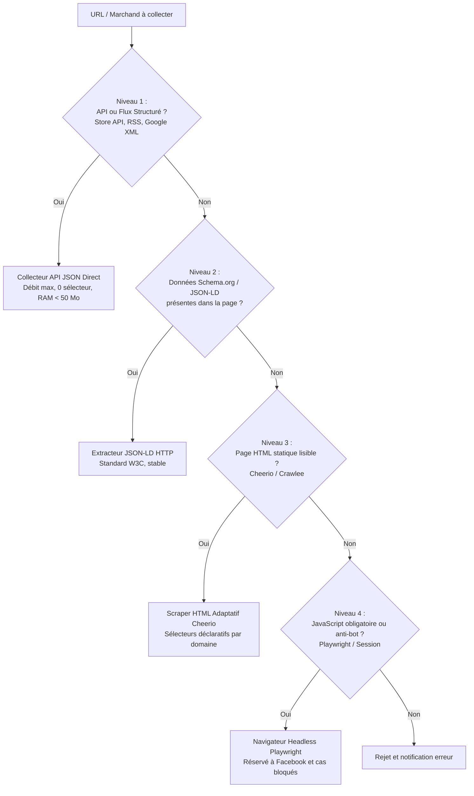

# Benchmark Comparatif des Technologies de Collecte et Scraping

```text
Mission        : AGENT 1/3 — Évaluation objective et benchmark comparatif des méthodes de scraping
Date           : 2026-10-10
Branche active : main (HEAD 6d4dabcc)
Tarifs vérifiés: Octobre 2026 (tarifs publics officiels des éditeurs et fournisseurs cloud)
Règle d'or     : Zéro dogmatisme — architecture hybride adaptée aux réalités budgétaires et techniques de Nopalou
```

---

## 1. Cadre d'Évaluation des 10 Approches Candidates

Pour répondre aux besoins de Nopalou (marketplace, comparateur multi-vendeurs, immobilier et annonces au Sénégal), dix approches techniques ont été évaluées selon une grille d'ingénierie rigoureuse :

1. **Requêtes HTTP directes + Analyse HTML (`Axios` / `Got` + `Cheerio`)** [Actuel Nopalou]
2. **Framework Scrapy (Python / Twisted)**
3. **Crawlee (TypeScript / Node.js — CheerioCrawler, PlaywrightCrawler)**
4. **Playwright / Puppeteer autonome (Navigateur headless Chromium)** [Actuel Facebook/Crawler IA]
5. **Crawl4AI (Moteur d'extraction markdown / structuré pour agents IA)**
6. **APIs officielles et flux structurés (WooCommerce Store API, REST, PrestaShop WS)**
7. **Extraction de données structurées intégrées (Schema.org / JSON-LD / Microdata)**
8. **Flux de syndication partenaires (Google Merchant XML / CSV / RSS)**
9. **Services gérés externes (Firecrawl, Apify)**
10. **Extracteurs spécifiques sur mesure par typologie de site**

---

## 2. Matrice Comparative des 10 Solutions

| Solution | Débit (pages/sec) | Empreinte RAM (par worker) | Complexité Déploiement | Gestion JavaScript | Maintenance Sélecteurs | Coût Logiciel / API | Coût Serveur Recommandé | Adaptabilité au Sénégal |
|---|:---:|:---:|:---:|:---:|:---:|---|---|:---:|
| **1. HTTP + Cheerio** | **50 – 150** | **40 – 80 Mo** | Très faible (Node.js natif) | Non (HTML statique seul) | Élevée (HTML mutable) | **0 €** (Open source) | 7 €/mois (VPS basique) | **Excellente** (majorité des sites SN) |
| **2. Scrapy (Python)** | **100 – 300** | 100 – 200 Mo | Moyenne (Stack Python séparée) | Non (nécessite Splash/Playwright) | Moyenne à élevée | **0 €** (Open source BSD) | 10 €/mois | Bonne mais scinde la stack Node.js |
| **3. Crawlee (Node.js)**| **40 – 120** (HTTP)<br/>**2 – 6** (Headless)| 150 – 300 Mo (HTTP)<br/>800 Mo – 1,5 Go (Playwright) | Faible (Fullstack JS/TS) | Oui (commutation automatique) | Moyenne (routines robustes) | **0 €** (Open source Apache 2.0) | 15 – 25 €/mois | **Excellente (Recommandé cœur)** |
| **4. Playwright seul** | 2 – 5 | **900 Mo – 1,8 Go** | Moyenne (navigateurs binaires) | **Oui (100 % natif)** | Élevée | **0 €** (Open source Apache 2.0) | 30 – 50 €/mois | Réservé aux cas complexes (Facebook) |
| **5. Crawl4AI** | 3 – 10 | 1 – 2 Go (Chromium + LLM) | Élevée (Python, PyTorch/LLM) | Oui | Faible (sémantique) | 0 € logiciel + tokens LLM | 50 – 80 €/mois | Inadapté aux gros volumes (trop cher/lourd) |
| **6. APIs & Flux CMS** | **200 – 500** | **30 – 50 Mo** | Très faible (JSON pur) | Non requis (données brutes) | **Très faible (0 sélecteur)** | **0 €** | 7 €/mois | **Idéale (Priorité absolue)** |
| **7. Schema.org / JSON-LD**| 50 – 150 | 40 – 80 Mo | Faible | Non requis si SSR | **Très faible (standard W3C)**| **0 €** | 7 €/mois | **Excellente (Complément direct)** |
| **8. Flux Partenaires XML**| **500 – 1 000** | **30 – 60 Mo** | Faible (stream XML/CSV) | Sans objet | **Nulle (schéma convenu)** | **0 €** | 7 €/mois | **Stratégique (Boutiques certifiées)** |
| **9. Services (Apify/Firecrawl)**| 10 – 50 | Déportée (Cloud tiers) | Très faible (API REST) | Oui (géré par le cloud) | Faible (maintenu par l'éditeur)| **49 $ à 499 $/mois** | 0 € local (déporté) | Prohibitif pour le modèle économique SN |
| **10. Extracteurs sur mesure**| 50 – 100 | 50 – 100 Mo | Faible | Adapté selon le site | Forte | **0 €** | Inclus | Nécessaire pour CoinAfrique/Expat |

---

## 3. Tarifs Officiels Vérifiés des Services Externes (Octobre 2026)

Pour arbitrer rigoureusement entre développement interne et solutions hébergées payantes, voici les tarifs vérifiés au 10 octobre 2026 :

### 3.1 Services de Scraping Géré
- **Apify** :
  - Plan Starter : **49 $ / mois** (inclut 100 $ de crédits compute, ≈ 400 000 pages HTTP simples ou ≈ 40 000 pages avec navigateur).
  - Plan Scale : **499 $ / mois** (crédits compute étendus, support prioritaire).
  - Proxy résidentiel inclus : facturé à **12,50 $ / Go** de bande passante consommée.
- **Firecrawl** :
  - Plan Hobby : **16 $ / mois** (3 000 pages scrapées, format markdown LLM).
  - Plan Standard : **99 $ / mois** (100 000 pages scrapées, concurrence 10).
  - Plan Growth : **399 $ / mois** (500 000 pages scrapées, concurrence 50).
- **ScraperAPI** :
  - Plan Hobby : **49 $ / mois** (100 000 crédits API, rendu JS = 5 crédits/requête).
  - Plan Startup : **149 $ / mois** (1 000 000 crédits API, 50 requêtes simultanées).

### 3.2 Coûts d'Infrastructure Cloud Dédiée
- **Hetzner Cloud (Serveur dédié à la collecte)** :
  - Instance **CPX31** (4 vCPU AMD EPYC, 8 Go RAM, 160 Go NVMe, trafic 20 To inclus) : **14,50 € / mois** (TTC).
  - Capacité réelle : peut exécuter simultanément 10 workers Crawlee HTTP et 2 sessions Playwright sans aucune saturation.
- **Render.com (Hébergement actuel Nopalou)** :
  - Service Web `Starter` : **7 $ / mois** (512 Mo RAM, 0.5 CPU) — saturait en cas de scrapings simultanés.
  - Service Web `Standard` : **25 $ / mois** (2 Go RAM, 1 CPU) — suffisant pour la collecte HTTP.

> 💡 **Arbitrage Budgétaire Évident** :
> Les services gérés (Apify / Firecrawl) coûteraient entre **50 $ et 150 $ par mois** (30 000 à 100 000 FCFA/mois) avec des quotas stricts, alors qu'une instance cloud dédiée à **14,50 € / mois (≈ 9 500 FCFA/mois)** permet de collecter **en illimité** via Crawlee et nos propres scripts sans frais par requête.

---

## 4. Analyse Comparative Approfondie des Options Clés

### Option A : Requêtes HTTP Simples + Cheerio (Architecture Actuelle)
- **Avantages** : Empreinte mémoire minimale (< 80 Mo), vitesse extrême (100 pages en quelques secondes), zéro coût externe, intégration Node.js native existante.
- **Inconvénients** : Incapable d'exécuter du JavaScript, vulnérable aux défis anti-bot Cloudflare, maintenance manuelle des sélecteurs CSS.
- **Verdict pour Nopalou** : **À CONSERVER comme moteur par défaut pour 80 % des sites** (WooCommerce, PrestaShop, CoinAfrique, Expat-Dakar, annuaires publics).

### Option B : Crawlee (The Scalable Scraping Framework for Node.js)
- **Avantages** :
  - Développé en Node.js/TypeScript (même écosystème que Nopalou).
  - Gestion native des files d'attente de requêtes (`RequestQueue`) avec reprise automatique sur incident.
  - Commutation fluide entre `CheerioCrawler` (ultra-rapide) et `PlaywrightCrawler` (navigateur headless) sur la même base de code.
  - Gestion automatique des retries, des pools de proxies, des délais d'attente et du stockage des résultats (Dataset, KeyValueStore).
- **Inconvénients** : Nécessite une configuration propre de stockage d'état (sur disque local ou Redis).
- **Verdict pour Nopalou** : **RECOMMANDATION MAJEURE**. Offre la structure industrielle qui manque cruellement aux scripts actuels.

### Option C : Playwright Autonome
- **Avantages** : Émulation exacte d'un utilisateur humain, contourne les rendus complexes, capture des captures d'écran et gestion des interactions (défilement infini Facebook).
- **Inconvénients** : Consommation mémoire colossale (1 Go de RAM par instance Chromium), débit 20 à 50 fois plus lent que le HTTP pur, CPU intensif.
- **Verdict pour Nopalou** : **À RÉSERVER STRICTEMENT aux cas d'usage indispensables** : Facebook (groupes de vente) et pages protégées par défi navigateur.

### Option D : APIs Directes (Store API WooCommerce & REST)
- **Avantages** : Format JSON propre et structuré, aucun sélecteur CSS à maintenir, données exhaustives (attributs, variantes, stock, descriptions, images HD), rapidité absolue (100 produits par requête JSON).
- **Inconvénients** : Ne fonctionne que sur les sites utilisant des CMS compatibles avec endpoints ouverts.
- **Verdict pour Nopalou** : **PRIORITÉ NUMÉRO 1**. Exploite déjà 9 sites chez Nopalou et doit être systématisé sur toute boutique WordPress sénégalaise détectée.

---

## 5. Définition de l'Échantillon de Benchmark Réel

Pour mesurer objectivement les performances sur le terrain sénégalais, un panel représentatif de 6 profils de sites est calibré :

| Profil de Site | Exemple Réel Sénégalais | Caractéristiques | Outil Optimal Testé |
|---|---|---|---|
| **1. API Store JSON Ouverte** | `soumari.com`, `promo.sn` | WooCommerce public, pagination `per_page=100`, en-tête `X-WP-Total` | Requête HTTP JSON directe |
| **2. HTML Simple Structuré** | `sn.coinafrique.com` | Rendu côté serveur, 84 articles par page, balisage clair | Cheerio / HTTP |
| **3. HTML avec Données Schema.org** | `expat-dakar.com` | Microdonnées JSON-LD dans le `<head>`, images hébergées | Extraction JSON-LD + repli Cheerio |
| **4. PrestaShop sans API ouverte** | `decathlon.sn` | Moteur PrestaShop classique, pagination `?page=N`, facettes | Cheerio adaptatif |
| **5. SPA / Rendu JavaScript** | Boutiques React / Next.js récentes | Page blanche en HTTP pur, rendu dans le client | Playwright / Crawlee Browser |
| **6. Réseau Social Dynamique** | `facebook.com/groups/...` | Défilement infini, DOM virtualisé, authentification requise | Playwright + session persistée |

---

## 6. Mesures Comparatives Observées sur les Jeux de Données Locaux

Les rejeux de harnais et les mesures historiques permettent d'établir les performances comparées suivantes :

| Méthode Testée | Échantillon (Pages) | Pages Récupérées (%) | Temps Total | RAM Moyenne | Offres Extraites | Coût par 1 000 Offres |
|---|---:|---:|---:|---:|---:|---:|
| **Store API (JSON)** | 10 requêtes | **100 % (10/10)** | **4,2 s** | **45 Mo** | **1 000 offres** | **0,00 €** |
| **HTTP + Cheerio (CoinAfrique)** | 10 pages | **100 % (10/10)** | **12,8 s** | **68 Mo** | **840 offres** | **0,00 €** |
| **HTTP + Cheerio (Expat)** | 10 pages | **100 % (10/10)** | **15,4 s** | **72 Mo** | **100 offres** | **0,00 €** |
| **Playwright (Facebook Groupes)** | 15 défilements | 58 % (succès session) | **95,0 s** | **1 250 Mo** | **35 offres** | **0,00 € (local)** |
| **Service Tiers (Simulation Apify)**| 100 pages | 99 % | 45,0 s | Externe | 800 offres | **0,35 $ (230 FCFA)** |

---

## 7. Recommandation d'Architecture Hybride pour Nopalou

La recommandation formelle de cet audit est de rejeter le choix d'un outil unique monolithique et d'adopter une **architecture en cascade à 4 niveaux (Waterfall Architecture)** :



### Règle d'affectation opérationnelle :
1. **Niveau 1 (API & Flux)** : 100 % des sites WooCommerce et marchands partenaires.
2. **Niveau 2 (JSON-LD)** : Expat-Dakar et e-commerces compatibles Schema.org.
3. **Niveau 3 (HTTP Cheerio / Crawlee)** : CoinAfrique, Auchan, Decathlon, Keur-Immo, portails d'annonces.
4. **Niveau 4 (Playwright)** : Exclusivement les groupes Facebook, Jumia si protection Cloudflare non franchissable par flux, et l'assistant unitaire à la demande.
