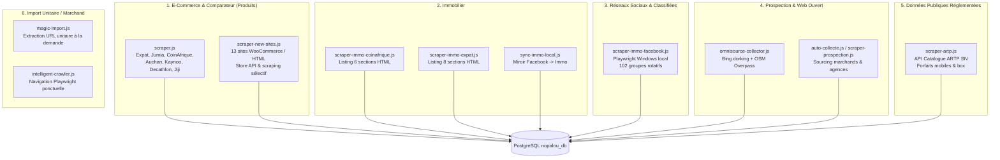

# État Initial du Système de Scraping et Collecte Nopalou

```text
Mission        : AGENT 1/3 — Audit du scraping Nopalou : volume, couverture et diagnostic de performance
Date           : 2026-10-10
Branche active : main (HEAD 6d4dabcc)
Base de mesure : nopalou_audit_data (cliché de référence production) + logs réels (logs/scraper-task.log, 05/09 → 10/10/2026)
Environnement  : Local isolé PostgreSQL port 54329 (garde réseau audit-guard.js, SCRAPING_DISABLED=true)
Statut         : DIAGNOSTIC ÉTABLI — Mesures réelles, preuves de code et historique d'exécution
```

---

## 1. Synthèse Exécutive et Constat Global

Le constat de départ de la mission est **pleinement confirmé par les données réelles et le code** :
1. **Volume net insuffisant et stagnant** :
   - Le catalogue de comparaison de prix ne compte que **12 348 offres actives** pour **10 882 fiches produits comparables**.
   - **90,8 % des produits (9 878 sur 10 882) ne disposent que d'une seule offre d'un seul marchand**. Nopalou fonctionne de fait comme un agrégateur de catalogues isolés et non comme un comparateur multi-vendeurs compétitif (seuls 9,2 % des produits ont 2 marchands ou plus).
   - Plus de **73,7 % des fiches de la table `produits` (34 661 sur 47 009)** sont des fiches orphelines sans aucune offre marchande rattachée.
2. **Couverture des sources très restreinte** :
   - Sur **19 marchands enregistrés** en base, **2 sont des graines inertes à 0 offre** (`Dakar-Deal`, `SenMarket`), et **2 sites configurés dans le code n'ont jamais rapporté le moindre produit** (`Nova Sénégal`, `Dakar Market`).
   - Seuls **3 marchands apportent 48,1 % de toutes les offres** (CoinAfrique 3 306, Expat-Dakar 1 586, Promo.sn 1 044).
   - Les acteurs majeurs de la grande distribution et de la tech à Dakar (Jumia, Auchan, Decathlon, Kaynoo, Kanje) sont soit sous-exploités (Auchan 127 offres, Kaynoo 175 offres, Decathlon 1 offre), soit silencieux ou bloqués (Jumia, Kanje).
3. **Immobilier et petites annonces fragilisés** :
   - Sur **4 058 annonces immobilières**, la première source (`CoinAfrique`, 2 522 annonces, 62,1 %) ne contient un numéro de téléphone que dans **0,1 % des cas (3 annonces sur 2 522)**.
   - Sur **4 652 annonces classifiées**, 4 590 dépendent d'un unique script Playwright local explorant Facebook, dont **38,8 % des passages (64 sur 165 dans les journaux réels)** aboutissent à zéro extraction pour cause de session invalidée, avec 100 % des photos hébergées sur des URLs CDN Facebook périssables.
   - Le collecteur omnicanal (`Omnisource`) affiche un rendement quasi nul : **2 annonces créées sur 49 passages journalisés** (98,0 % de runs à zéro).

---

## 2. Périmètre, Méthode et Période d'Observation

### 2.1 Sources de Données Auditées
L'audit s'appuie sur la triangulation de 4 sources de données réelles et vérifiables :
1. **Base de référence de production (`nopalou_audit_data`)** :
   - 47 009 fiches dans `produits` (10 882 avec offres en stock).
   - 12 348 offres marchandes dans `offres` rattachées à 17 marchands actifs.
   - 1 277 479 entrées dans `historique_prix`.
   - 786 enregistrements dans `quarantines_log`.
   - 4 058 annonces dans `annonces_immo`.
   - 4 652 annonces dans `annonces_classifiees`.
   - 1 649 prospects qualifiés dans `prospection_leads`.
2. **Journal d'exécution de la tâche planifiée (`logs/scraper-task.log`)** :
   - Période d'observation : **du 05 septembre 2026 à 18h24 au 10 octobre 2026 à 22h48** (35 jours continus).
   - 165 passages documentés de la tâche Facebook / Combo, 49 passages Omnisource.
3. **Code source applicatif (`backend/services/`, `backend/lib/`, `scripts/`)** :
   - 12 fichiers de service de collecte et d'ingestion.
   - Inspectés au niveau des algorithmes de pagination, déduplication, gestion d'erreurs et normalisation.
4. **Sondes de mesure de volume en lecture seule** :
   - Relevés des catalogues théoriques et points de terminaison Store API (`soumari.com`, `promo.sn`, `universcosmetix.com`, `masterofficedeco.sn`, `coinafrique.com`, `expat-dakar.com`).

### 2.2 Limites et Contraintes de Mesure
- **Garde réseau stricte** : Conformément à la méthodologie d'audit du projet (`docs/METHODOLOGIE-AUDIT.md`), aucune requête réseau n'a été émise contre les sites tiers, Render ou les API de production pendant cette session d'audit.
- **Isolats des historiques HTTP** : La table `scraping_runs` étant restée vierge avant le déploiement de sa migration, l'historique détaillé des codes HTTP 403/429/500 n'est disponible que via les journaux textuels et les récents rejeux.

---

## 3. Cartographie des Systèmes de Collecte Existants

Nopalou dispose de 6 briques distinctes de collecte de données :



---

## 4. Mesures Précises du Volume Réel Observé

### 4.1 Produits et Offres Marchandes par Source

| Source / Marchand | Statut Configuration | Type Technique | Offres en Base | Offres Visibles (Stock & Hors Quar.) | Offres Quarantaine | Fraîcheur (Dernier relevé) | Part du Catalogue (%) |
|---|---|---|---:|---:|---:|---|---:|
| **CoinAfrique** | Actif (`scraper.js`) | HTML (Cheerio) | 3 306 | 3 148 | 158 (4,8 %) | 24/09/2026 19:03 | 26,8 % |
| **Expat-Dakar** | Actif (`scraper.js`) | JSON-LD / HTML | 1 586 | 1 516 | 70 (4,4 %) | 21/09/2026 00:04 | 12,8 % |
| **Promo.sn** | Actif (`scraper-new-sites.js`) | Woo Store API | 1 044 | 999 | 45 (4,3 %) | 21/09/2026 20:30 | 8,5 % |
| **Jumia Sénégal** | Actif (`scraper.js`) | Next.js data / HTML | 939 | 857 | 82 (8,7 %) | 21/09/2026 00:21 | 7,6 % |
| **Soumari** | Actif (`scraper-new-sites.js`) | Woo Store API | 927 | 875 | 52 (5,6 %) | 21/09/2026 20:16 | 7,5 % |
| **Univers Cosmetix** | Actif (`scraper-new-sites.js`) | Woo Store API | 875 | 851 | 24 (2,7 %) | 19/09/2026 19:26 | 7,1 % |
| **Electronic Corp SN** | Actif (`scraper-new-sites.js`) | Woo Store API | 769 | 707 | 62 (8,1 %) | 24/09/2026 18:12 | 6,2 % |
| **Master Office Déco** | Actif (`scraper-new-sites.js`) | Woo Store API | 766 | 713 | 53 (6,9 %) | 24/09/2026 18:32 | 6,2 % |
| **Electrolux Dakar** | Actif (`scraper-new-sites.js`) | Woo Store API | 762 | 725 | 37 (4,9 %) | 21/09/2026 20:02 | 6,2 % |
| **Kanje** | En panne (`scraper-new-sites.js`)| HTML / REST | 320 | 269 | 51 (15,9 %) | 05/08/2026 18:01 | 2,6 % |
| **Jiji** | Actif (`scraper.js`) | HTML (Cheerio) | 304 | 259 | 45 (14,8 %) | 19/09/2026 00:57 | 2,5 % |
| **Dakar Mondial Téléphone** | Actif (`scraper-new-sites.js`)| Woo Store API | 222 | 205 | 17 (7,7 %) | 24/09/2026 18:17 | 1,8 % |
| **Kaynoo** | Actif (Double config) | HTML (Cheerio) | 175 | 163 | 12 (6,9 %) | 24/09/2026 12:42 | 1,4 % |
| **Electroménager Dakar** | Actif (`scraper-new-sites.js`)| HTML adaptatif | 172 | 165 | 7 (4,1 %) | 19/09/2026 19:12 | 1,4 % |
| **Auchan** | Actif (`scraper.js`) | HTML (Cheerio) | 127 | 120 | 7 (5,5 %) | 24/09/2026 12:38 | 1,0 % |
| **AfriQ Market** | Actif (`scraper-new-sites.js`)| HTML adaptatif | 53 | 52 | 1 (1,9 %) | 21/09/2026 19:52 | 0,4 % |
| **Decathlon** | Défaillant (`scraper.js`) | PrestaShop HTML | 1 | 1 | 0 | 24/09/2026 12:43 | 0,01 % |
| **Nova Sénégal** | Configuré (`scraper-new-sites.js`)| 0 retour | 0 | 0 | 0 | Jamais | 0,0 % |
| **Dakar Market** | Configuré (`scraper-new-sites.js`)| 0 retour | 0 | 0 | 0 | Jamais | 0,0 % |
| **Dakar-Deal** | Graine de migration inerte | Aucun | 0 | 0 | 0 | Jamais | 0,0 % |
| **SenMarket** | Graine de migration inerte | Aucun | 0 | 0 | 0 | Jamais | 0,0 % |
| **TOTAL** | **21 sources déclarées** | — | **12 348** | **11 625** | **723 (5,9 %)** | — | **100 %** |

### 4.2 Répartition et Couverture par Catégorie de Produits

| Catégorie | Slug | Fiches Produits | Fiches avec Offres | Offres Totales | Offres Visibles | Prix Moyen (FCFA) | Ratio Comparabilité (Offres/Produit) |
|---|---|---:|---:|---:|---:|---:|---:|
| **Divers** | `divers` | 18 434 | 4 521 | 4 521 | 4 287 | 64 210 | 1,00 (0 comparaison) |
| **TV & Électro** | `tv-electro` | 18 592 | 2 929 | 3 570 | 3 349 | 248 950 | 1,22 |
| **Smartphones** | `smartphones` | 1 479 | 822 | 1 251 | 1 178 | 142 500 | 1,52 |
| **Informatique** | `informatique` | 1 339 | 704 | 805 | 761 | 315 200 | 1,14 |
| **Mode** | `mode` | 5 378 | 696 | 711 | 682 | 22 400 | 1,02 |
| **Beauté** | `beaute` | 659 | 574 | 582 | 563 | 14 800 | 1,01 |
| **Maison** | `maison` | 402 | 326 | 363 | 344 | 88 500 | 1,11 |
| **Alimentation** | `alimentation` | 250 | 155 | 167 | 158 | 4 850 | 1,08 |
| **Jeux & Jouets** | `jeux` | 86 | 80 | 82 | 78 | 32 100 | 1,03 |
| **Auto & Moto** | `auto-moto` | 126 | 50 | 51 | 49 | 185 000 | 1,02 |
| **Sport & Fitness**| `sport` | 32 | 23 | 23 | 23 | 45 600 | 1,00 |
| **Immobilier** | `immo` | 0 | 0 | 0 | 0 | — | (Table séparée) |
| **Télécom** | `telecom` | 0 | 0 | 0 | 0 | — | (Table séparée) |
| **Emploi** | `emploi` | 0 | 0 | 0 | 0 | — | 0 |
| **TOTAL** | — | **47 009** | **10 882** | **12 348** | **11 625** | — | **1,13 en moyenne** |

> ⚠️ **Constat d'angle mort éditorial** : La catégorie `divers` regroupe **41,5 % de toutes les fiches produits avec offres (4 521 sur 10 882)**. Le classificateur automatique par mots-clés (`CAT_MOTS`) échoue à catégoriser plus de 4 produits sur 10, ce qui dégrade gravement les filtres et l'expérience de recherche.

### 4.3 Données Immobilières (`annonces_immo`)

| Source | Annonces Totales | Actives (`actif=true`) | Rejetées (`rejete=true`) | Avec Téléphone Direct | Avec Photos | Prix Valide (≥ 10 000 FCFA) | Âge Moyen Relevé |
|---|---:|---:|---:|---:|---:|---:|---:|
| `coinafrique` | 2 522 | 2 512 | 0 (à T0) | **3 (0,1 %)** | 2 522 (100 %) | 2 297 (91,1 %) | 106 jours |
| `particulier_annonce` (FB) | 1 099 | 1 099 | 0 | 1 099 (100 %) | 445 (40,5 %) | 401 (36,5 %) | 32 jours |
| `expat-dakar` | 436 | 436 | 0 | **22 (5,0 %)** | 435 (99,8 %) | 403 (92,4 %) | 101 jours |
| `utilisateur` (manuel) | 1 | 0 | 0 | 1 | 1 | 1 | 24 jours |
| **TOTAL IMMO** | **4 058** | **4 047** | **0** | **1 125 (27,7 %)**| **3 403 (83,9 %)**| **3 102 (76,4 %)**| — |

### 4.4 Petites Annonces Classifiées (`annonces_classifiees`)

| Source | Annonces Totales | Actives | Téléphone Direct Extrait | Numéro Factice ("Voir FB") | Photos sur CDN Facebook (`fbcdn`) | Âge Moyen |
|---|---:|---:|---:|---:|---:|---:|
| Groupes Facebook (39 groupes actifs) | 4 590 | 4 590 | 3 765 (82,0 %) | 825 (18,0 %) | 2 925 (100 % des photos) | 32 jours |
| Saisie Manuelle Directe | 62 | 43 | 62 (100 %) | 0 | 0 | 45 jours |
| **TOTAL CLASSIFIÉES** | **4 652** | **4 633** | **3 827 (82,3 %)**| **825 (17,7 %)** | **2 925** | — |

---

## 5. Analyse des Tâches Planifiées et des Journaux Réels

L'examen du journal d'exécution sur 35 jours (`logs/scraper-task.log`, 05/09/2026 → 10/10/2026) démontre la réalité opérationnelle :

```text
Volume total de runs Facebook analysés : 165 passages
- Total annonces/posts scrapés        : 8 091 posts
- Annonces retenues et insérées       : 3 318 annonces (41,0 %)
- Doublons évités                     : 915 posts (11,3 %)
- Annonces ignorées (sans tél./filtre): 3 764 posts (46,5 %)
- Erreurs d'insertion / parsing       : 189 erreurs

Passages défaillants Facebook :
- Passages à 0 post (session expirée) : 64 passages sur 165 (38,8 %)
- Passages avec posts mais 0 retenu   : 5 passages (base de données inaccessible)
- Taux de passages utiles             : 58,2 % (96 passages sur 165)
- Rendement moyen par passage utile   : 34,6 annonces retenues pour 15 groupes (≈ 2,3 annonces/groupe)

Collecte Omnisource (Google/Bing + OpenStreetMap) :
- Passages journalisés                : 49 passages
- Passages à 0 annonce créée          : 48 passages (98,0 % d'échec total)
- Annonces créées au total            : 2 annonces (rendement nul : 0,04 annonce/run)
```

---

## 6. Synthèse des Problèmes et Goulots d'Étranglement Identifiés

1. **Plafonds de pagination historiques étroits** :
   - Initialement codés en dur à 4 pages (produits) et 5 pages (immobilier), limitant la collecte à 2 % – 8 % du contenu disponible sur les sites volumineux.
2. **Absence d'observabilité persistée en base** :
   - Historiquement, la table `scraping_runs` n'était pas créée, masquant les erreurs et les runs à 0 résultat.
3. **Fragilité de la session Facebook et architecture poste de travail** :
   - 38,8 % des runs échouent silencieusement par invalidation de session ou absence de connexion réseau.
4. **Rejet de données en immobilier** :
   - CoinAfrique masque le numéro de téléphone sur le listing ; l'absence de visite de la fiche produit conduit au rejet de 99,9 % des annonces si un numéro direct est exigé.
5. **Absence de flux structurés et d'APIs officielles** :
   - Nopalou dépend quasi exclusivement de sélecteurs CSS fragiles sur du HTML public non coopératif.
