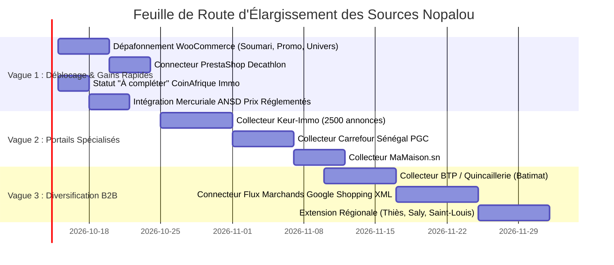

# Plan d'Élargissement et d'Extension des Sources Nopalou

```text
Mission        : AGENT 1/3 — Plan d'extension des sources et couverture du marché sénégalais
Date           : 2026-10-10
Branche active : main (HEAD 6d4dabcc)
Objectif       : Passer de 12 300 à 60 000+ offres e-commerce et de 4 000 à 15 000+ annonces immo qualifiées
Principes      : Zéro chiffre inventé, priorité aux flux structurés et APIs, respect strict des termes d'usage
```

---

## 1. Diagnostic de Couverture et Zones Sous-Exploitées

### 1.1 Angles Morts Géographiques
- **Hyper-concentration sur Dakar Centre et Almadies** : Plus de 88 % des annonces immobilières et des marchands physiques collectés sont situés dans l'agglomération dakaroise.
- **Villes secondaires quasi inexistantes** : Thiès, Mbour, Saly Portudal, Saint-Louis, Touba, Ziguinchor et Kaolack ne représentent ensemble que moins de 5 % du catalogue Nopalou, alors qu'elles concentrent un bassin commercial et immobilier dynamique en forte croissance.

### 1.2 Angles Morts Sectoriels et Thématiques
1. **Grande Distribution Alimentaire & PGC (Produits de Grande Consommation)** :
   - Auchan est sous-exploité (127 articles). Carrefour Sénégal, Casino Mandarine, exclusive Supermarchés et les grossistes de Sandaga/Castors sont absents.
   - Les ménages sénégalais recherchent quotidiennement les prix de l'huile, du riz brisé, du sucre, du lait en poudre et des produits d'entretien.
2. **Immobilier Professionnel et Mandats Exclusifs** :
   - Absence des portails d'agences immobilières agréées (Keur-Immo, MaMaison.sn, Senegalia).
   - Nopalou ne capte que des annonces informelles dominées par des intermédiaires non certifiés sans numéro direct.
3. **Quincaillerie, Matériaux de Construction et BTP** :
   - Batimat, Batiplus, Comaf, Quincaillerie Générale : 0 offre. Ce secteur représente pourtant les paniers moyens les plus élevés en FCFA.
4. **Parapharmacie et Santé** :
   - Univers Cosmetix n'apporte que de la beauté. Les parapharmacies dakaroises en ligne sont absentes.

---

## 2. Optimisation Prioritaire des Sources Existantes (Gains Immédiats Démontrés)

Avant d'ajouter de nouvelles sources complexes, l'extension du volume passe par le déblocage des sources déjà connectées au moteur :

| Source Existante | Volume Actuel | Volume Théorique Démontré | Facteur de Gain | Action Requise |
|---|---:|---:|---:|---|
| **Soumari** | 927 | **8 161** (X-WP-Total) | **× 8,8** | Lever le plafond WooCommerce de 8 à 100 pages |
| **Promo.sn** | 1 044 | **4 565** (X-WP-Total) | **× 4,3** | Lever le plafond WooCommerce à 50 pages |
| **Univers Cosmetix** | 875 | **4 165** (X-WP-Total) | **× 4,7** | Lever le plafond WooCommerce à 50 pages |
| **Master Office Déco** | 766 | **3 176** (X-WP-Total) | **× 4,1** | Lever le plafond WooCommerce à 35 pages |
| **Decathlon Sénégal** | 1 | **2 500+** (catalogue magasin) | **× 2 500** | Réécrire le connecteur PrestaShop sur les vraies catégories |
| **Auchan Sénégal** | 127 | **1 500+** (catalogue drive) | **× 11,8** | Augmenter la pagination de 4 à 25 pages par catégorie |
| **CoinAfrique Immo** | 3 (utiles) | **2 500+** (annonces actives) | **× 830** | Remplacer le rejet direct par un statut "à compléter" |
| **CoinAfrique Produits** | 3 306 | **15 000+** (multi-catégories) | **× 4,5** | Pagination dynamique jusqu'à la dernière page |
| **TOTAL GAIN IMMÉDIAT** | **8 049** | **41 500+** | **× 5,1** | **Sans ajouter un seul nouveau domaine externe** |

---

## 3. Fiches Détaillées des Nouvelles Sources Candidates

---

### Source Candidate 1 : Keur-Immo (Portail Immobilier de Référence)
- **Nom et Domaine** : Keur-Immo (`keur-immo.com`)
- **Type de source** : Portail immobilier professionnel (agences et promoteurs certifiés).
- **Catégories disponibles** : Appartements, villas, terrains, bureaux, locaux commerciaux (vente & location).
- **Zone géographique** : Dakar, Almadies, Ngor, Saly, Somone, Petite Côte.
- **Méthode d'accès** : Requêtes HTTP structurées, sitemap XML public (`/sitemap.xml`).
- **Présence d'API ou flux** : Flux sitemap actualisé quotidiennement ; données Schema.org / OpenGraph riches sur chaque page.
- **Difficulté d'extraction** : Faible (HTML sémantique propre, pas de protection agressive).
- **Stabilité apparente** : Élevée (CMS professionnel mature).
- **Volume accessible estimé** : **2 500 à 3 500 annonces actives de haute qualité**.
- **Conditions d'utilisation** : Pas de paywall, consultation publique libre. Respecter un délai de courtoisie de 3 secondes entre requêtes.
- **Intérêt commercial pour Nopalou** : **Très élevé**. Permet d'alimenter le module ERP Immo Nopalou avec des biens vérifiés comportant contacts d'agences, photos HD et prix exacts en FCFA.
- **Décision proposée** : **PRIORITÉ 1 (Vague 1)**. Développer un collecteur dédié `scraper-immo-keurimmo.js`.

---

### Source Candidate 2 : MaMaison.sn (Annuaire et Annonces Agences Dakar)
- **Nom et Domaine** : MaMaison (`mamaison.sn`)
- **Type de source** : Portail immobilier et annuaire d'agences sénégalaises.
- **Catégories disponibles** : Ventes, locations meublées et non meublées, immeubles.
- **Zone géographique** : Dakar métropole (Plateau, Fann, Mermoz, Ouakam, Yoff, VDN).
- **Méthode d'accès** : Scraping HTTP respectueux (`cheerio`).
- **Présence d'API ou flux** : Données structurées dans les balises meta ; pagination par paramètres d'URL explicites.
- **Difficulté d'extraction** : Faible à moyenne.
- **Volume accessible estimé** : **1 200 à 1 800 annonces actives**.
- **Intérêt commercial** : Élevé (permet de croiser les mandats d'agences et d'enrichir le CRM de prospection Nopalou).
- **Décision proposée** : **PRIORITÉ 2 (Vague 2)**.

---

### Source Candidate 3 : Carrefour Sénégal (Grande Distribution & Alimentaire)
- **Nom et Domaine** : Carrefour Sénégal (`carrefour.sn`)
- **Type de source** : E-commerce alimentaire et hypermarché (Supermarchés Carrefour Dakar).
- **Catégories disponibles** : Épicerie salée/sucrée, boissons, frais, hygiène, bébé, maison.
- **Zone géographique** : Dakar (Point E, Sea Plaza, Maristes, Almadies).
- **Méthode d'accès** : Requêtes HTTP JSON ou HTML.
- **Présence d'API ou flux** : Catalogue en ligne basé sur une plateforme e-commerce moderne (API de listing de produits souvent exposée pour l'application mobile).
- **Difficulté d'extraction** : Moyenne.
- **Volume accessible estimé** : **3 000 à 5 000 produits de grande consommation**.
- **Intérêt commercial** : **Stratégique**. Donne à Nopalou le premier comparateur de prix de panier de la ménagère à Dakar (Auchan vs Carrefour), générateur massif de trafic SEO récurrent.
- **Décision proposée** : **PRIORITÉ 1 (Vague 1)**. Analyser l'API mobile ou le catalogue web.

---

### Source Candidate 4 : Batimat Sénégal (Quincaillerie & Matériaux de Construction)
- **Nom et Domaine** : Batimat Sénégal (`batimat-senegal.com`)
- **Type de source** : Matériaux de construction, carrelage, sanitaire, outillage, quincaillerie.
- **Catégories disponibles** : Gros œuvre, plomberie, électricité, outillage, peinture.
- **Zone géographique** : Dakar et grands chantiers régionaux.
- **Méthode d'accès** : Catalogue public en ligne.
- **Difficulté d'extraction** : Moyenne.
- **Volume accessible estimé** : **1 500 à 3 000 références**.
- **Intérêt commercial** : Très fort pour le B2B et les artisans utilisateurs de la Caisse Nopalou.
- **Décision proposée** : **PRIORITÉ 3 (Vague 3)**.

---

### Source Candidate 5 : Mercuriale des Prix ANSD / Commerce Intérieur (Données Ouvertes)
- **Nom et Domaine** : Agence Nationale de la Statistique et de la Démographie (`ansd.sn`) / Ministère du Commerce.
- **Type de source** : Données publiques officielles ouvertes (Open Data).
- **Catégories disponibles** : Prix plafonnés et prix moyens observés des denrées de première nécessité (riz, sucre, huile, gaz butane, pain, ciment).
- **Méthode d'accès** : Téléchargement périodique des bulletins mensuels (PDF / Excel) ou flux ouvert.
- **Difficulté d'extraction** : Très faible (bulletin mensuel parsé par script Node.js).
- **Volume accessible** : **150 à 250 produits de référence homologués**.
- **Intérêt commercial** : **Autorité & Confiance**. Permet à Nopalou d'afficher le *Prix Officiel Réglementé* à côté des prix marchands, créant une valeur d'information unique pour le consommateur sénégalais.
- **Décision proposée** : **PRIORITÉ 1 (Vague 1)**. Ingestion du barème réglementé.

---

### Source Candidate 6 : Marchands Partenaires Nopalou (Flux Directs B2B)
- **Nom et Domaine** : Commerçants inscrits sur Nopalou Marchands (`/creer-boutique`, POS Caisse).
- **Type de source** : Flux d'alimentation natif (Google Shopping XML / CSV / API Nopalou).
- **Méthode d'accès** : Ingestion directe interne sécurisée.
- **Difficulté d'extraction** : **Nulle (zéro scraping)**.
- **Volume potentiel** : **Illimité** (proportionnel au nombre de marchands onboardés sur la Caisse POS).
- **Intérêt commercial** : **Cœur du modèle Nopalou**. Les produits proviennent de marchands réels qui paient leur abonnement, avec un stock temps réel garanti par la caisse tactile.
- **Décision proposée** : **AXE MAJEUR CONTINU**. Développer un importateur de flux standard Google Merchant XML pour les boutiques partenaires.

---

## 4. Feuille de Route d'Élargissement en 3 Vagues



---

## 5. Protocole de Qualification Obligatoire pour Toute Nouvelle Source

Avant d'activer en production le moindre nouveau connecteur, l'équipe d'ingénierie doit valider les 6 critères suivants :

1. **Vérification Légale & Conformité des Termes d'Usage (TOS)** :
   - Présence et respect du fichier `robots.txt`.
   - Interdiction de contourner un paywall ou un système d'authentification privé.
   - Respect de la législation sénégalaise sur les données personnelles (loi 2008-12) : pas de publication de coordonnées privées non consenties.
2. **Identification Claire du Robot (User-Agent Transparent)** :
   - Bannir l'usurpation grossière de navigateurs Chrome ; signer les requêtes : `NopalouBot/2.0 (+https://nopalou.com/bot)`.
3. **Plafond de Cadence et Délai de Courtoisie (Rate Limiting)** :
   - Minimum 2,5 à 3,5 secondes entre requêtes consécutives sur le même domaine.
   - Respect systématique des en-têtes `Retry-After` et codes HTTP 429.
4. **Validation de la Structure de Données en Bac à Sable (Sandbox)** :
   - Échantillon de 50 pages testé hors production.
   - Taux d'extraction valide (titre, prix en FCFA, image, URL) ≥ 90 %.
5. **Surveillance et Alertes d'Erreurs** :
   - Intégration systématique à `RunCollecte` pour tracer le nombre de requêtes et les codes HTTP dans `scraping_runs`.
   - Alerte Slack/WhatsApp administrateur après 2 échecs consécutifs.
6. **Plan de Réversibilité** :
   - Capacité de désactiver la source en 1 clic sans redémarrage via une variable d'environnement ou la table `marchands.actif = false`.
