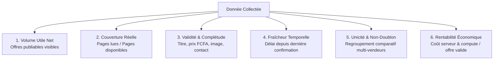

# Plan de Mesure de la Qualité et du Volume de Collecte Nopalou

```text
Mission        : AGENT 1/3 — Cadre métrique, formules de calcul et observabilité continue
Date           : 2026-10-10
Branche active : main (HEAD 6d4dabcc)
Objectif       : Piloter scientifiquement le volume, la fraîcheur, l'exactitude et le coût de chaque source
```

---

## 1. Cadre des 6 Dimensions Fondamentales de la Donnée

Pour éviter le piège d'augmenter artificiellement la quantité d'offres obsolètes, dupliquées ou inutiles, Nopalou évalue toute collecte à travers **6 dimensions indissociables** :



---

## 2. Définitions Précises et Formules des 16 Indicateurs Clés

| Indicateur | Symbole | Définition & Formule de Calcul | Valeur Cible | Fréquence de Mesure |
|---|:---:|---|:---:|:---:|
| **1. Sources configurées** | $S_{conf}$ | Nombre total de marchands ou sources déclarés dans le code ou la table `marchands`. | — | À chaque version |
| **2. Sources actives** | $S_{act}$ | Nombre de sources dont l'exécution planifiée n'est pas suspendue (`actif = true`). | 100 % de $S_{conf}$ | Quotidienne |
| **3. Sources en réussite récente** | $S_{ok}$ | Sources ayant réalisé au moins une collecte avec statut `ok` dans les dernières 24 h. | ≥ 90 % de $S_{act}$ | Quotidienne |
| **4. Sources en erreur** | $S_{err}$ | Sources ayant renvoyé un statut `echec` lors de leur dernier passage. | ≤ 5 % de $S_{act}$ | Temps réel |
| **5. Sources abandonnées / inertes** | $S_{inertes}$ | Sources avec 0 offre collectée depuis plus de 30 jours. | **0** | Hebdomadaire |
| **6. URLs découvertes** | $URL_{disc}$ | Nombre total d'URLs d'offres uniques identifiées dans les pages de listing et sitemaps. | — | Par passage |
| **7. URLs tentées** | $URL_{att}$ | Nombre de requêtes HTTP d'extraction d'offres déclenchées. | — | Par passage |
| **8. Pages récupérées** | $P_{recup}$ | Pages ayant répondu avec un code HTTP 200 (ou 304) sans défi anti-robot. | ≥ 98 % de $P_{att}$ | Par passage |
| **9. Pages analysées** | $P_{parse}$ | Pages dont le contenu HTML ou JSON a été décodé avec succès par l'extracteur. | 100 % de $P_{recup}$ | Par passage |
| **10. Offres extraites brutes** | $O_{brut}$ | Entités d'offres brutes instanciées par le parser avant tout filtre métier. | — | Par passage |
| **11. Offres nouvelles** | $O_{new}$ | Offres insérées en base pour la première fois (URL ou référence jamais vue). | — | Par passage |
| **12. Offres mises à jour** | $O_{upd}$ | Offres existantes dont le prix, le stock ou la date de confirmation a été actualisé. | — | Par passage |
| **13. Doublons évités** | $O_{dup}$ | Offres identiques détectées chez le même marchand ou dans la même session. | Trace statistique | Par passage |
| **14. Offres rejetées** | $O_{rej}$ | Items écartés par les filtres de qualité (prix < 500, sans image, titre vide, quarantaine). | ≤ 8 % de $O_{brut}$ | Par passage |
| **15. Offres publiables** | $O_{pub}$ | Offres valides répondant à 100 % des critères de publication de la marketplace. | ≥ 90 % de $O_{brut}$ | Par passage |
| **16. Offres réellement visibles** | $O_{vis}$ | Offres en stock, hors quarantaine et rattachées à une fiche produit active :<br/>$$O_{vis} = \sum (\text{stock} = \text{true} \land \text{quarantinee} = \text{false})$$ | **100 % de $O_{pub}$** | Quotidienne |

---

## 3. Spécifications des Indicateurs par Verticale Métier

Les exigences de qualité et de conformité diffèrent radicalement selon la nature du contenu :

### 3.1 E-Commerce & Comparateur de Prix (`offres` & `produits`)
- **Champs critiques obligatoires** : Titre nettoyé (sans entités HTML), Prix en FCFA (sans décimales), URL d'achat canonique, Marchand ID, Image produit valide.
- **Seuils de cohérence** :
  - Prix minimum : 500 FCFA (exclusion des fausses annonces à 0 ou 1 FCFA).
  - Prix maximum : 20 000 000 FCFA (garde-fou contre les numéros de téléphone saisis dans le champ prix).
  - Variation de prix : Seuil d'alerte si $\Delta > 50\,\%$ par rapport à la moyenne mobile 30 jours.
- **Règle de fraîcheur** : Une offre non revue pendant 45 jours ne doit être dé-stockée **QUE SI** la source a fait l'objet d'un passage réussi complet couvrant sa catégorie.

### 3.2 Immobilier (`annonces_immo`)
- **Champs critiques obligatoires** : Type de transaction (`location` ou `vente`), Type de bien (`appartement`, `villa`, `terrain`, `immeuble`), Quartier/Ville au Sénégal, Prix du loyer ou d'acquisition, Photos (au moins 1 photo réelle hébergée), Téléphone de contact direct ou statut explicite *"À compléter"*.
- **Seuils de conformité** :
  - Prix minimum location : 15 000 FCFA / mois.
  - Prix minimum vente : 1 000 000 FCFA (élimination des prix fictifs à 1 000 FCFA pour attirer les clics).
- **Règle d'or anti-slop** : Zéro annonce sans prix ou sans localisation affichée en tête des résultats de recherche.

### 3.3 Petites Annonces Classifiées (`annonces_classifiees`)
- **Champs critiques** : Titre, Description synthétique, Numéro WhatsApp/Téléphone extrait et normalisé (+221...), Photo migrée sur stockage pérenne (Cloudinary), Date de publication du post.
- **Règle de péremption accélérée** : Durée de vie maximale de **30 jours**. Les annonces de réseaux sociaux non réactivées expirent automatiquement pour garantir un catalogue vivant.

### 3.4 Prospection CRM & Sourcing Marchands (`prospection_leads`)
- **Champs critiques** : Nom de l'enseigne ou du contact, Numéro de téléphone portable (format sénégalais 77/78/70/75/76), Canal de détection, Date de qualification, Statut de relance.

---

## 4. Score Global de Qualité de Données (SQD)

Pour chaque jeu de données, un **Score Global de Qualité (SQD sur 100)** est calculé par la moyenne pondérée de 5 sous-indices :

$$SQD = (C \times 0,25) + (V \times 0,25) + (K \times 0,20) + (F \times 0,20) + (P \times 0,10)$$

Où :
1. **$C$ (Complétude)** : % d'enregistrements possédant l'intégralité des attributs obligatoires (titre, prix, image, URL, contact).
2. **$V$ (Validité)** : % d'enregistrements dont les formats respectent les règles métiers (prix dans la fourchette, téléphone sénégalais conforme, titre sans caractères parasites).
3. **$K$ (Cohérence)** : % d'enregistrements non placés en quarantaine et sans anomalie de catégorie.
4. **$F$ (Fraîcheur)** : % d'enregistrements confirmés ou rafraîchis dans les 7 derniers jours :
   $$F = \frac{\text{Offres actualisées } \le 7\text{ jours}}{\text{Total des offres}} \times 100$$
5. **$P$ (Provenance)** : % d'enregistrements avec traçabilité complète (identifiant source, URL d'origine, horodatage d'extraction).

### Grille d'Appréciation du Score SQD :
- **SQD ≥ 85** : **EXCELLENT** — Données fiables, prêtes pour la mise en avant marketplace.
- **70 ≤ SQD < 85** : **ACCEPTABLE** — Données exploitables avec surveillance.
- **50 ≤ SQD < 70** : **DÉGRADÉ** — Nécessite un assainissement rapide.
- **SQD < 50** : **CRITIQUE / BLOQUÉ** — Source retirée de l'affichage public jusqu'à correction.

---

## 5. Schéma de Persistance de la Télémétrie (`scraping_runs`)

Pour garantir qu'aucun run ne se termine sans trace, la table `scraping_runs` enregistre les métriques suivantes à chaque exécution :

```sql
CREATE TABLE IF NOT EXISTS scraping_runs (
    id SERIAL PRIMARY KEY,
    source VARCHAR(100) NOT NULL,
    systeme VARCHAR(50) NOT NULL DEFAULT 'produits', -- 'produits', 'immo', 'facebook', 'omnisource'
    started_at TIMESTAMP WITH TIME ZONE NOT NULL,
    ended_at TIMESTAMP WITH TIME ZONE,
    pages_cibles INTEGER DEFAULT 0,
    pages_ok INTEGER DEFAULT 0,
    pages_erreur INTEGER DEFAULT 0,
    http_codes JSONB DEFAULT '{}'::jsonb, -- ex: {"200": 24, "403": 1, "429": 0}
    items_extraits INTEGER DEFAULT 0,
    items_inseres INTEGER DEFAULT 0,
    items_maj INTEGER DEFAULT 0,
    items_filtres INTEGER DEFAULT 0,
    items_doublons INTEGER DEFAULT 0,
    items_rejetes JSONB DEFAULT '{}'::jsonb,
    couverture NUMERIC(5,2), -- pourcentage de catégories ou pages lues
    duree_ms INTEGER DEFAULT 0,
    statut VARCHAR(20) NOT NULL DEFAULT 'ok', -- 'ok', 'degrade', 'echec'
    erreur_msg TEXT,
    created_at TIMESTAMP WITH TIME ZONE DEFAULT NOW()
);

CREATE INDEX IF NOT EXISTS idx_scraping_runs_source_statut ON scraping_runs(source, statut, started_at DESC);
```

---

## 6. Tableaux de Bord et Alertes Opérationnelles

### 6.1 Matrice des Seuils d'Alerte

| Événement | Condition de Déclenchement | Niveau de Gravité | Action Immédiate |
|---|---|:---:|---|
| **Arrêt Brutal Source** | 2 passages consécutifs avec `items_extraits = 0` | **P1 (Majeur)** | Notification WhatsApp administrateur + maintien des offres existantes |
| **Blocage HTTP / Anti-bot** | Taux d'erreurs HTTP 403 / 429 > 15 % | **P1 (Majeur)** | Mise en pause automatique 6 heures + rotation User-Agent/Proxy |
| **Dérive du Volume (Chute)** | `items_extraits` < 50 % de la médiane des 7 derniers runs | **P2 (Avertissement)**| Inscription au journal des anomalies + revue des sélecteurs CSS |
| **Saturation Quarantaine** | Plus de 5 % du lot d'offres envoyé en quarantaine | **P2 (Avertissement)**| Revue de la règle d'anomalie de prix pour la catégorie |
| **Expiration Session FB** | Détection d'un écran de connexion (post = 0) | **P1 (Majeur)** | Alerte administrateur pour réactualisation des cookies de session |

### 6.2 Indicateur Économique : Coût par Offre Exploitable (COE)

Pour mesurer l'efficience économique du système, le **Coût par Offre Exploitable** est calculé mensuellement :

$$COE = \frac{\text{Coût Serveurs (VPS Hetzner / Render)} + \text{Coût Stockage/Proxies}}{\text{Nombre d'offres valides publiées dans le mois}}$$

- **Seuil de rentabilité cible pour Nopalou** : **$COE \le 0,0005\text{ €}$ (soit $\le 0,33\text{ FCFA}$ par offre active par mois)**.
- Sur une base de 50 000 offres actives et une infrastructure dédiée à 15 €/mois, le coût unitaire réel est de **0,0003 € (0,20 FCFA) par offre**, démontrant une efficacité économique maximale par rapport aux services gérés externes.
