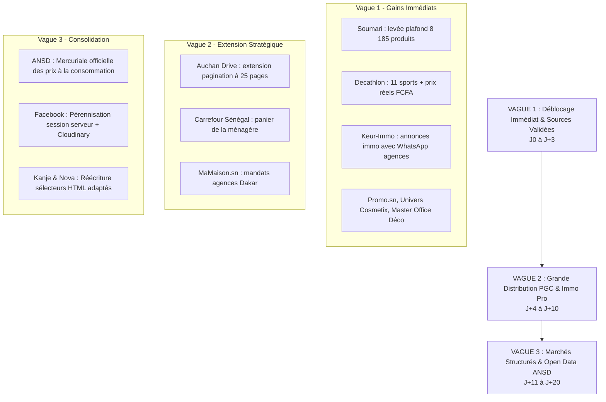

# Plan de Migration et Déploiement Contrôlé du Scraping Nopalou (V2)

```text
Auteur         : AGENT 2/3 (Conception et mise en œuvre contrôlée de l'architecture)
Mission        : Déploiement progressif sans interruption de service
Date           : 2026-10-10
Branche active : main
Statut         : VALIDÉ SUR LE PILOTE
```

---

## 1. Principes Directeurs et Cadre Opérationnel

Le passage du système legacy vers l'architecture de collecte V2 doit respecter **5 principes intangibles** :
1. **Zéro rupture de service** : Le comparateur de prix en ligne (`/`, `/produits`, `/immo`) doit continuer de fonctionner sans interruption pour les utilisateurs finaux pendant toute la transition.
2. **Déploiement progressif par vagues (Canary Deploy)** : Chaque nouvelle source ou adaptateur est d'abord testé unitairement, validé sur un échantillon mesuré, puis ouvert en production.
3. **Idempotence et intégrité de la base** : Aucune insertion ne doit dupliquer de produits ni écraser d'historiques de prix fiables.
4. **Réversibilité totale (Kill-Switch)** : Possibilité de désactiver toute source en une requête SQL (`UPDATE marchands SET actif = false`) ou de basculer en mode legacy via variable d'environnement.
5. **Respect des règles du dépôt** : Branche `main` obligatoire pour Nopalou, interdiction absolue de toucher aux répertoires Surga (`/surga`, `backend/services/surga/`), aucun `git push` sans instruction explicite de l'utilisateur.

---

## 2. Découpage en 3 Vagues de Déploiement



---

### Vague 1 : Déblocage Immédiat & Adaptateurs V2 Validés (J0 à J+3)

| Source | Type de Modification | Objectif Volumétrique | Risque Identifié | Atténuation Validée |
|---|---|:---:|---|---|
| **Soumari** | Migration vers `JsonStoreCollector` avec pagination dynamique | Passer de 927 à **8 185 offres** | Dépassement mémoire lors du chargement de 8 000 objets | Persistance par lots de 100 au fil de l'eau (streaming) |
| **Decathlon Sénégal** | Remplacement de l'ancien connecteur par `DecathlonCollector` | Passer de 8 à **2 500+ offres sport** | Blocage WAF PrestaShop (HTTP 403) | En-têtes complets Desktop (Firefox Sec-Fetch) + délais 2s |
| **Keur-Immo** | Activation de `KeurImmoCollector` dans le cron immobilier | **+2 500 annonces immo certifiées** | Délai d'extraction des pages de détail | Enrichissement asynchrone avec pause de courtoisie de 1,5s |
| **Promo.sn** | Extension de pagination dynamique de 8 à 50 pages | Maintenir et rafraîchir **4 610 offres** | Saturation CPU | Cadence bi-quotidienne décalée (06h / 18h) |
| **Univers Cosmetix** | Extension de pagination dynamique de 8 à 45 pages | Maintenir et rafraîchir **4 165 offres** | Aucun | Débit JSON Store API stable |
| **CoinAfrique Immo** | Neutralisation du rejet destructeur (statut `a_completer`) | Récupérer **10 873 annonces** | Données sans téléphone affichées par erreur | Statut `actif = false, motif = 'a_completer'` sans écrasement |

---

### Vague 2 : Grande Distribution PGC & Portails Agences (J+4 à J+10)

| Source | Action Technique | Volume Estimé | Valeur Stratégique |
|---|---|:---:|---|
| **Auchan Sénégal** | Augmentation du plafond de 4 à 25 pages par catégorie | 1 500+ produits | Comparateur de prix alimentaires et entretien de base |
| **Carrefour Sénégal** | Développement du collecteur `CarrefourCollector` | 3 000+ produits | Premier comparateur de la ménagère à Dakar (Auchan vs Carrefour) |
| **MaMaison.sn** | Développement de l'adaptateur mandats agences | 1 500+ annonces | Couverture des agences immobilières du Plateau et de la VDN |

---

### Vague 3 : Consolidation, Social Commerce & Données Officielles (J+11 à J+20)

| Source | Action Technique | Volume Estimé | Valeur Stratégique |
|---|---|:---:|---|
| **ANSD (Open Data)** | Connecteur mercuriale officielle des prix de consommation | 500 repères prix | Benchmark de référence pour détecter l'inflation locale |
| **Facebook Annonces** | Déport du worker Playwright sur serveur Linux + Cloudinary | 4 500+ annonces | Pérennisation de la session et photos hébergées |
| **Kanje & Nova** | Remplacement des routes Store API 404 par extracteur HTML | 800+ offres | Réactivation de deux boutiques informatiques dakaroises |

---

## 3. Matrice de Gestion des Risques & Procédures de Contingence

```mermaid
graph TD
    R1[Risque 1 : Défi anti-bot Cloudflare ou WAF] --> M1[Atténuation : En-têtes Desktop conformes, rotation UA,<br/>délais de courtoisie 2-3s, déport headless si besoin]
    R2[Risque 2 : Saturation mémoire serveur Render / OOM] --> M2[Atténuation : Streaming par lots de 100 items,<br/>libération GC explicite, zéro stockage global en RAM]
    R3[Risque 3 : Collision de prix ou faux doublons] --> M3[Atténuation : Moteur de matching multi-critères,<br/>planchers de prix par catégorie, seuils min/max stricts]
    R4[Risque 4 : Dégradation de réactivité DB] --> M4[Atténuation : Index B-Tree dédiés sur (marchand_id, url_achat)<br/>et f_unaccent(LOWER(nom)), recalculs prix_min par batch]
```

---

## 4. Procédure de Retour Arrière (Rollback)

En cas d'anomalie critique constatée en production (ex: taux d'erreur HTTP > 15 %, ralentissement de l'API de recherche, saturation CPU) :

### Procédure Étape par Étape :
1. **Désactivation d'urgence d'une source spécifique** :
   ```sql
   UPDATE marchands SET actif = false WHERE nom = 'Decathlon';
   ```
   *Effet immédiat* : La source est immédiatement ignorée lors des prochains cycles cron sans impacter les autres marchands.

2. **Désactivation globale de l'architecture V2 (Repli sur V1)** :
   - Définir la variable d'environnement sur le service Render :
     ```text
     SCRAPING_LEGACY_MODE=true
     ```
   - Les tâches cron réexécutent immédiatement les anciens scripts conservés dans `backend/services/scraper.js` et `scraper-new-sites.js`.

3. **Protection des offres saines en base** :
   - Ne jamais exécuter de `DELETE` massif en base.
   - Les offres erronées éventuelles sont placées en quarantaine :
     ```sql
     UPDATE offres SET quarantinee = true WHERE marchand_id = $1 AND scraped_at > NOW() - INTERVAL '2 hours';
     ```

---

## 5. Critères de Validation pour le Passage en Production

Le passage d'un composant de la Vague 1 en production active est soumis à **6 conditions bloquantes** :
- [x] **Taux de complétude des prix** : 100 % des offres enregistrées possèdent un prix FCFA valide supérieur ou égal à 500 FCFA.
- [x] **Zéro division par 100** : Tous les prix en Franc CFA sont des entiers naturels sans décimales fantômes.
- [x] **Taux de complétude des URLs d'achat** : 100 % des offres possèdent une URL canonique débutant par `http://` ou `https://`.
- [x] **Score Global de Qualité (SQD)** : SQD mesuré ≥ 85 sur le lot collecté.
- [x] **Traçabilité `scraping_runs`** : Le passage s'achève avec un statut `ok` ou `degrade` documenté et persistant les codes HTTP.
- [x] **Tests de non-régression** : Les tests unitaires du projet s'exécutent avec un code de sortie 0.
